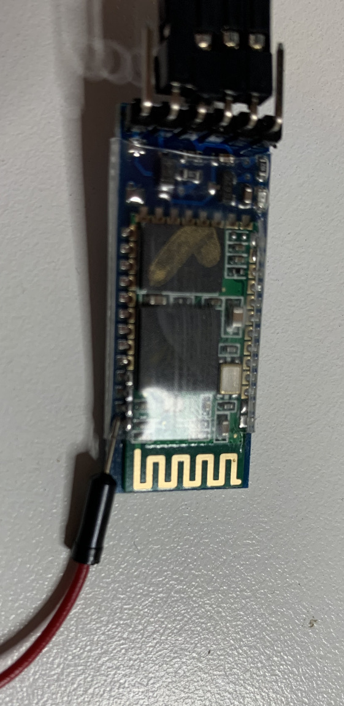
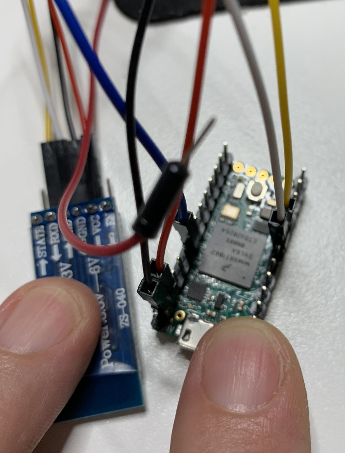

## Switching the HC-05 bluetooth module to AT command mode

The command mode is necessary to update the baudrate, password, name, etc.

### PlatformIO
This is a [platformIO](https://platformio.org/) project. But the it should work when converted to an Arduino sketch as well.

### HW Setup
Most of the online tutorials use HC05 with a switch that allows it to boot in AT command mode, 
however, the ones sold by Core Electronics don't have this switch.

There is a simple workaround for this - you need to set PIN34 to high (3.3V):

Because it's the last pin, it's possible to simply touch it with the lead passed under the heatsink.

It needs to be on high at power up so the simplest way is to disconnect the power to HC05 first (ONLY the power lead),
then touch this PIN34 with a lead set to HIGH and then reconnect the power.
If successful, the LED will start blinking very slowly.

### AT Commands to Send
__Very important when sending the AT commands you need to use CR + LF as new lines otherwise it won't work__
I used CuteCom, selected /dev/ttyACM0, 9600 and changed the line endings to CR + LF
and sent the following commands:
  1) AT
  2) AT+VERSION?
  3) AT+UART=115200,1,0

Each of the commands should receive response OK (the version command should also return the version)

### Wiring
The bluetooth module is connected to RX2 and TX2 on the Teensy 4.0 (hence the Serial2 use in the code).

__RX on the HC05 connects to the TX on the Teensy and HC05's TX connect's to the Teensy's RX__

* HC05 RX to PIN8
* HC05 TX to PIN 7
* HC05 GDN to GDN
* HD05 VCC to 3V (should work with 5V as well)

